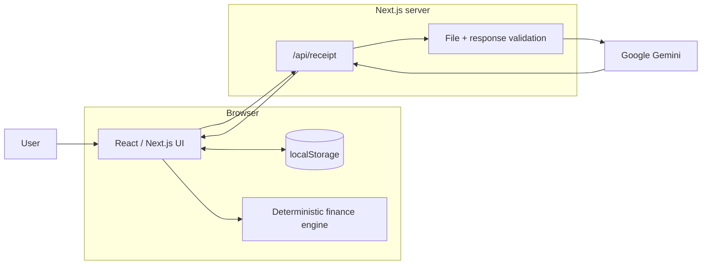
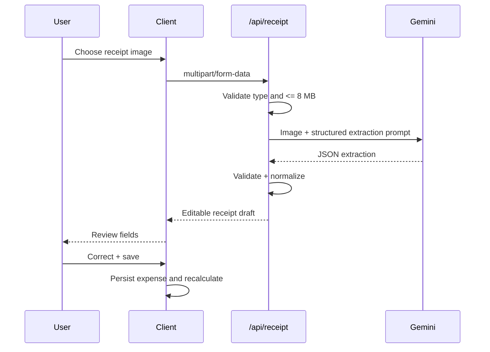

# Ledgerly Architecture

**Team:** LSH26-T022
**Problem:** P12 — Personal Ledger Manager
**Live:** https://lsh26-t022-p12.vercel.app

## 1. Architecture Summary

Ledgerly is a Next.js application with a browser-resident ledger, a deterministic TypeScript finance engine, and one server endpoint for receipt-image extraction.



## 2. Core Design Boundary

AI is limited to receipt perception.

```text
AI responsibilities
└── receipt amount/date/shop/category extraction

Deterministic TypeScript responsibilities
├── money totals
├── month filtering
├── category aggregation
├── largest expenses
├── previous-month comparison
├── forecasting
├── written insights
├── savings affordability
├── goal completion
└── DPS compounding
```

This prevents generative output from becoming authoritative financial arithmetic.

## 3. Client State

The ledger is persisted under:

```text
ledgerly-state-v1
```

The persisted state contains the source data. Analytics are derived from it and recomputed after mutations.

```text
LedgerState
├── today
├── salaryBdt
├── expenses[]
├── pockets[]
└── dpsAnnualRatePercent
```

## 4. Expense Mutation Model

### Create

```text
validated form / reviewed receipt
  → append expense
  → persist ledger
  → recompute derived views
```

### Edit

```text
select saved expense
  → prefilled edit form
  → replace matching expense by ID
  → persist
  → recompute
```

### Delete

```text
select saved expense
  → confirmation
  → filter expense by ID
  → persist
  → recompute
```

No separate analytics cache is maintained, reducing stale-data risk.

## 5. Receipt Sequence



## 6. Finance Engine

`src/lib/finance.ts` is independent of the receipt provider.

Key functions include:

- monthly dashboard aggregation;
- pace-based current-month forecast;
- deterministic insights;
- integer-paisa DPS compounding;
- savings affordability and completion projection.

### Forecast

```text
projectedSpend
= spentSoFar / elapsedDays × daysInMonth
```

```text
projectedBalance
= salary - projectedSpend
```

### Savings affordability

```text
forecastSavingsBudget = max(projectedBalance, 0)
```

If planned contributions exceed the budget, contributions are proportionally reduced using a funding ratio.

### DPS

Each monthly cycle:

```text
balance += deposit
interest = half_up_to_paisa(balance × annualRate / 12 / 100)
balance += interest
```

## 7. Failure Isolation

Receipt AI failure does not invalidate the core ledger.

```text
Gemini unavailable
├── receipt scan: degraded
└── manual entry/dashboard/forecast/savings: still available
```

Client UX provides editable results, errors and retry paths rather than silent failure.

## 8. Persistence Choice

`localStorage` was selected for hackathon reliability:

- no database provisioning;
- no auth dependency;
- instant persistence;
- simple production deployment.

Trade-off: state is device/browser-specific.

## 9. Security

- Gemini API key stays server-side.
- `.env.local` is not committed.
- image MIME and file size are validated.
- structured AI output is validated before use.
- no real bank/DPS account is connected.
- savings outputs are illustrative.

## 10. Verification

The final finance implementation was locally checked against all 25 supplied P12 public cases and passed 25/25.

Release gates:

```bash
npm run typecheck
npm run lint
npm run build
git diff --check
```

Production smoke checks cover the receipt route, ledger mutations, persistence, analytics, forecast and savings/DPS flows.
