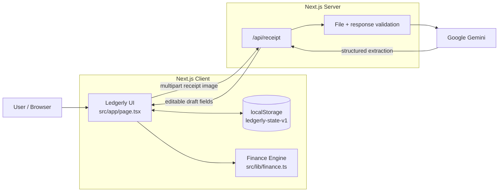

# Ledgerly — P12 Personal Ledger Manager

> **LofiStack Hackathon 2026 · Team LSH26-T022 · Problem P12**

**Live application:** https://lsh26-t022-p12.vercel.app
**Repository:** https://github.com/johirul-islam-1/lsh26-t022-p12

Ledgerly is a personal finance workspace for salaried users. It reduces receipt-entry friction, turns transactions into a month-aware dashboard, projects the likely month-end outcome, and converts expected surplus into realistic savings-pocket and DPS projections.

The system uses **AI only where perception is useful**—reading receipt images—and keeps **financial arithmetic deterministic, testable, and explainable**.

---

## Table of Contents

1. [Problem](#1-problem)
2. [Product Vision](#2-product-vision)
3. [Users and Jobs To Be Done](#3-users-and-jobs-to-be-done)
4. [P12 Requirements and Proof](#4-p12-requirements-and-proof)
5. [Solution Overview](#5-solution-overview)
6. [Core User Flows](#6-core-user-flows)
7. [System Design](#7-system-design)
8. [Architecture Responsibilities](#8-architecture-responsibilities)
9. [Financial Calculation Design](#9-financial-calculation-design)
10. [Receipt Extraction Design](#10-receipt-extraction-design)
11. [Expense History, Edit and Delete](#11-expense-history-edit-and-delete)
12. [Persistence Model](#12-persistence-model)
13. [Project Structure](#13-project-structure)
14. [Local Setup](#14-local-setup)
15. [Environment Variables](#15-environment-variables)
16. [API](#16-api)
17. [Testing and Verification](#17-testing-and-verification)
18. [Production Deployment](#18-production-deployment)
19. [Security and Privacy](#19-security-and-privacy)
20. [Major Design Decisions](#20-major-design-decisions)
21. [Known Limitations](#21-known-limitations)
22. [What Is Real vs Seeded](#22-what-is-real-vs-seeded)
23. [AI Usage and Verification](#23-ai-usage-and-verification)
24. [Demo Path](#24-demo-path)
25. [Team Contributions](#25-team-contributions)
26. [Submission Metadata](#26-submission-metadata)
27. [Future Roadmap](#27-future-roadmap)

---

## 1. Problem

A personal ledger is only useful if people actually keep it updated and can understand what the numbers mean.

Traditional manual tracking creates two major problems.

### 1.1 Expense capture is high-friction

A user may receive a receipt or bill but still has to manually type:

- amount;
- transaction date;
- merchant/shop;
- category.

That friction makes expense tracking easy to abandon.

### 1.2 Transaction lists do not answer financial questions

Even after recording expenses, the user still needs to know:

- How much salary has already been spent?
- How much money remains?
- Which categories are consuming the most money?
- What are the largest individual expenses?
- How does this month compare with last month?
- At the current spending pace, what will the month-end total be?
- Will there be money left or a shortfall?
- Can planned monthly savings contributions actually be afforded?
- When will a savings goal be completed?
- What would a DPS-style monthly deposit return over the same period?

The real product problem is therefore not just **expense storage**. It is turning raw transactions into **monthly financial decisions**.

---

## 2. Product Vision

Ledgerly is built around one job:

> **Help a salaried user capture expenses quickly, understand the current month, anticipate the month-end outcome, and make realistic savings decisions.**

The product deliberately connects four stages:

```text
Capture
  ↓
Understand
  ↓
Forecast
  ↓
Plan
```

This makes the ledger useful after every new transaction instead of acting as a passive record.

---

## 3. Users and Jobs To Be Done

### Primary user

A salaried individual who wants a simple monthly view of personal spending without using a complex accounting system.

### Core jobs

The user wants to:

1. record an expense quickly;
2. correct receipt extraction before saving;
3. see monthly totals and categories;
4. compare with the previous month;
5. understand likely month-end spending;
6. know whether the month will end with money left or a shortfall;
7. create savings goals;
8. understand whether planned contributions are affordable;
9. compare the same contribution with a DPS-style return;
10. correct or delete a saved transaction if it was entered incorrectly.

---

## 4. P12 Requirements and Proof

| Requirement | Status | Product proof | Implementation proof |
| --- | --- | --- | --- |
| **R1 — Salary + expenses + receipt upload and editable extraction** | Complete | `Add expense`, `Scan receipt`, extraction review before save | `src/app/page.tsx`, `src/app/api/receipt/route.ts` |
| **R2 — Monthly dashboard** | Complete | spent vs salary, available balance, category breakdown, largest expenses, previous-month comparison, month navigation | `src/app/page.tsx`, `src/lib/finance.ts` |
| **R3 — Forecast + written insights** | Complete | projected monthly spend, expected remaining spend, expected money left/shortfall, 3 amount-backed insights | `src/app/page.tsx`, `src/lib/finance.ts` |
| **R4 — Savings pockets + completion + DPS comparison** | Complete | target, item details, monthly contribution, forecast-adjusted affordability, completion date, DPS return | `src/app/page.tsx`, `src/lib/finance.ts` |

### Additional ledger-management UX

Beyond the required four flows, Ledgerly also provides:

- `View all` expense history for the selected month;
- edit saved expense;
- delete saved expense with confirmation;
- automatic recalculation after edit/delete;
- browser persistence after refresh.

---

## 5. Solution Overview

Ledgerly separates probabilistic work from deterministic work.

```text
Receipt image
   │
   ▼
Gemini multimodal extraction
   │
   ▼
Editable user confirmation
   │
   ▼
Saved expense
   │
   ├──────────────► Monthly dashboard
   │
   ├──────────────► Forecast + insights
   │
   └──────────────► Savings affordability + DPS
```

### Probabilistic responsibility

AI is responsible only for interpreting receipt images and suggesting:

- amount;
- date;
- merchant/shop;
- category;
- confidence.

### Deterministic responsibility

TypeScript finance logic is responsible for:

- money aggregation;
- category totals;
- largest expenses;
- month comparison;
- forecast;
- written insight selection;
- savings affordability;
- goal duration;
- completion date;
- DPS compounding.

This keeps important financial outputs reproducible and avoids asking a generative model to perform core finance calculations.

---

## 6. Core User Flows

### 6.1 Manual expense flow

```text
Add expense
  ↓
Enter amount/date/shop/category
  ↓
Validate
  ↓
Save
  ↓
Persist
  ↓
Recalculate dashboard + forecast + savings
```

### 6.2 Receipt flow

```text
Scan receipt
  ↓
Choose JPG / PNG / WebP
  ↓
POST /api/receipt
  ↓
Server validates file
  ↓
Gemini extracts structured fields
  ↓
Editable review
  ↓
User corrects if needed
  ↓
Save
  ↓
Ledger recalculates
```

### 6.3 Saved expense correction flow

```text
View all
  ↓
Choose transaction
  ↓
Edit
  ↓
Prefilled form
  ↓
Save changes
  ↓
Same expense ID retained
  ↓
Ledger recalculates
```

### 6.4 Delete flow

```text
View all
  ↓
Delete
  ↓
Inline confirmation
  ├─ Cancel → no change
  └─ Confirm → remove expense
                    ↓
               Persist
                    ↓
          Recalculate analytics
```

### 6.5 Savings flow

```text
Current-month forecast
  ↓
Expected month-end balance
  ↓
Forecast savings budget
  ↓
Compare with planned pocket contributions
  ↓
Affordable effective contribution
  ↓
Months to goal
  ↓
Expected completion date
  ↓
DPS return over same duration
```

---

## 7. System Design



### Data ownership

```text
Browser localStorage
└── LedgerState
    ├── today
    ├── salaryBdt
    ├── expenses[]
    ├── pockets[]
    └── dpsAnnualRatePercent
```

### Recalculation strategy

Derived data is not independently persisted.

Instead:

```text
LedgerState changes
  ↓
React state updates
  ↓
finance.ts recomputes derived data
  ↓
UI rerenders
```

This reduces synchronization bugs between raw transactions and calculated values.

---

## 8. Architecture Responsibilities

### `src/app/page.tsx`

Owns the primary product interaction:

- salary editing;
- manual expense creation;
- receipt upload;
- receipt review/correction;
- month navigation;
- expense history;
- saved expense editing;
- expense deletion;
- dashboard rendering;
- forecast rendering;
- savings pocket UI;
- DPS-rate editing;
- persistence coordination.

### `src/app/api/receipt/route.ts`

Server-only receipt endpoint:

- accepts receipt image;
- validates MIME type;
- validates file size;
- protects Gemini API key from the browser;
- requests structured receipt extraction;
- validates response shape;
- normalizes category;
- returns safe user-visible errors.

### `src/lib/finance.ts`

Deterministic domain engine:

- money formatting;
- month filtering;
- total spending;
- previous-month totals;
- category aggregation;
- largest expenses;
- pace forecast;
- written insights;
- DPS calculation;
- savings-pocket planning.

### `src/lib/types.ts`

Shared domain types and allowed categories.

---

## 9. Financial Calculation Design

### 9.1 Integer paisa

Financial values are converted to integer paisa where practical.

Example:

```text
BDT 98.21 → 9821 paisa
```

This avoids common decimal floating-point issues during aggregation and DPS interest handling.

### 9.2 Monthly spending

For a selected month:

```text
spent = sum(expenses in selected month)
```

```text
available = salary - spent
```

The previous month is calculated independently so different months are not mixed.

### 9.3 Category breakdown

Expenses are grouped by category and summed.

The same source transactions drive:

- category totals;
- share of spending;
- insight selection.

### 9.4 Largest expenses

Transactions for the active month are sorted by amount and the highest-value items are shown in the dashboard.

---

## 10. Forecast Design

For the active current month:

```text
projectedSpend
= spentSoFar / elapsedDays × totalDaysInMonth
```

```text
expectedRemainingSpend
= max(projectedSpend - spentSoFar, 0)
```

```text
projectedBalance
= salary - projectedSpend
```

Completed historical months use actual recorded spending instead of pretending to forecast a finished period.

### Why this approach

The hackathon dataset provides limited personal history. A complex ML model would add opacity and implementation risk without enough training history.

The selected model is:

- explainable;
- deterministic;
- easy to validate;
- immediately useful.

---

## 11. Written Insights

The insight layer is generated from deterministic numbers rather than an LLM.

Insights reference real:

- categories;
- BDT amounts;
- spending concentration;
- pace/balance context.

The current implementation produces at least three insights when sufficient spending data exists.

This avoids hallucinated financial advice while still making the dashboard understandable.

---

## 12. Savings and DPS Design

### 12.1 Forecast savings budget

```text
forecastSavingsBudget
= max(projectedBalance, 0)
```

### 12.2 Planned contribution

```text
plannedMonthly
= sum(all pocket monthly contributions)
```

### 12.3 Affordability

If:

```text
forecastSavingsBudget >= plannedMonthly
```

then every pocket keeps its requested contribution.

Otherwise:

```text
fundingRatio
= forecastSavingsBudget / plannedMonthly
```

and:

```text
effectiveContribution
= requestedContribution × fundingRatio
```

This prevents Ledgerly from showing a savings plan that exceeds the amount expected to remain at month end.

### 12.4 Completion duration

For a positive effective contribution:

```text
monthsToGoal
= ceil(target / effectiveContribution)
```

A completion date is derived from that number of monthly contribution cycles.

### 12.5 DPS rule

For every month:

```text
1. balance = balance + deposit

2. interest
   = balance × annualRate / 12 / 100

3. round interest half-up to paisa

4. balance = balance + roundedInterest
```

Interest joins the balance and therefore compounds in later months.

The DPS result shown by Ledgerly is an illustrative calculation based on the entered annual rate; it is not a bank quotation or financial guarantee.

---

## 13. Receipt Extraction Design

### Accepted images

- JPEG
- PNG
- WebP
- maximum 8 MB

### Structured extraction fields

The server asks Gemini for:

```text
amountBdt
date
shop
category
confidence
```

The response is validated before the browser receives it.

### Human-in-the-loop correction

AI output is **never silently committed** as financial truth.

The extraction becomes an editable draft. The user can correct:

- amount;
- date;
- merchant/shop;
- category.

Only then is the transaction saved.

### Failure handling

Receipt scanning handles:

- missing image;
- unsupported file format;
- bad file size;
- missing Gemini configuration;
- invalid provider response;
- provider/extraction failure.

Manual expense entry remains usable even when the receipt provider is unavailable.

---

## 14. Expense History, Edit and Delete

The `View all` action opens the active month's expense history.

Each transaction exposes:

- date;
- shop;
- category;
- amount;
- edit action;
- delete action.

### Edit behaviour

Edit uses the same validation rules as expense entry.

The original expense ID is retained while editable fields are replaced.

After save:

- monthly total recalculates;
- categories recalculate;
- largest expenses recalculate;
- forecast recalculates;
- insights recalculate;
- savings projections recalculate.

### Delete behaviour

Delete requires confirmation.

After confirmation the transaction is removed and all derived views recompute from the remaining ledger.

---

## 15. Persistence Model

The hackathon version uses browser `localStorage`.

Key:

```text
ledgerly-state-v1
```

### Why localStorage

For the hackathon scope it provides:

- zero database setup;
- no authentication dependency;
- immediate persistence;
- low deployment risk;
- easy judge interaction.

### Trade-off

Data is browser/device-specific and is not synchronized to other devices.

A commercial version would use authenticated server-side persistence.

---

## 16. Project Structure

```text
lsh26-t022-p12/
├── src/
│   ├── app/
│   │   ├── api/
│   │   │   └── receipt/
│   │   │       └── route.ts
│   │   ├── globals.css
│   │   ├── layout.tsx
│   │   └── page.tsx
│   │
│   └── lib/
│       ├── demo.ts
│       ├── finance.ts
│       └── types.ts
│
├── public/
├── .env.example
├── .gitignore
├── ARCHITECTURE.md
├── EVENT.md
├── LICENSES.md
├── README.md
├── evaluation-manifest.json
├── eslint.config.mjs
├── next.config.ts
├── package.json
├── package-lock.json
└── tsconfig.json
```

The core judging paths are:

```text
src/app/page.tsx
src/app/api/receipt/route.ts
src/lib/finance.ts
src/lib/types.ts
```

---

## 17. Local Setup

### Requirements

- Node.js 20+
- npm

Clone:

```bash
git clone https://github.com/johirul-islam-1/lsh26-t022-p12.git
cd lsh26-t022-p12
```

Install:

```bash
npm install
```

Run:

```bash
npm run dev
```

Open:

```text
http://localhost:3000
```

### Running without a private API key

The application can start and the manual ledger/dashboard/forecast/savings flows can run without a private key.

Receipt AI extraction requires a Gemini API key in local development.

The hosted production deployment already has its receipt-service environment configured.

---

## 18. Environment Variables

Copy the example:

```bash
cp .env.example .env.local
```

Then set:

```env
GEMINI_API_KEY=your_private_key_here
GEMINI_MODEL=gemini-3.7-flash
```

`GEMINI_MODEL` is optional.

Never commit:

```text
.env
.env.local
.env.production
API keys
tokens
private credentials
```

---

## 19. API

### `GET /api/receipt`

Health/configuration check.

Example:

```json
{
  "ok": true,
  "build": "b1-receipt",
  "geminiConfigured": true,
  "model": "gemini-3.7-flash"
}
```

### `POST /api/receipt`

Input:

```text
multipart/form-data
field: receipt
```

Accepted:

```text
image/jpeg
image/png
image/webp
```

Maximum:

```text
8 MB
```

Success returns an editable structured extraction.

Failure returns a safe status/code/message rather than exposing provider secrets.

---

## 20. Testing and Verification

Before final release:

```bash
npm run typecheck
npm run lint
npm run build
git diff --check
```

### Product smoke tests

The final product should be manually verified for:

- edit salary;
- add manual expense;
- scan receipt;
- edit extracted receipt before save;
- month navigation;
- category breakdown;
- largest expenses;
- previous-month comparison;
- forecast;
- 3 written insights;
- new savings pocket;
- DPS rate edit;
- `View all`;
- edit saved expense;
- delete cancel;
- delete confirm;
- refresh persistence.

### Public-case regression

The deterministic finance engine was locally tested against the supplied P12 public dataset.

Result:

```text
25 / 25 public cases passed
```

The run covered varying:

- salaries;
- months;
- month lengths;
- elapsed-day positions;
- expense distributions;
- categories;
- savings targets;
- contribution values;
- DPS annual rates.

The public dataset is organizer-provided test material and is not required in the production repository.

Passing public cases is evidence of consistency with the published cases; it does not claim knowledge of hidden evaluation cases.

---

## 21. Production Deployment

Production:

```text
https://lsh26-t022-p12.vercel.app
```

For a runtime code change:

```bash
npx vercel --prod
```

Verify:

```bash
curl -sS https://lsh26-t022-p12.vercel.app/api/receipt
```

Then open the production site in a private/incognito browser and run the main smoke path.

---

## 22. Security and Privacy

- Gemini API credentials stay server-side.
- Secret environment files are ignored by Git.
- The browser does not receive the Gemini API key.
- Receipt-image input is validated before provider use.
- Receipt extraction output is validated before use.
- Ledger persistence is local to the user's browser in this hackathon build.
- No authentication or cloud user database is claimed.
- No real money is transferred by savings pockets.
- DPS results are illustrative calculations only.

A production financial application would additionally require:

- authenticated storage;
- encryption and retention policies;
- API rate limiting;
- audit logging;
- monitoring;
- stronger abuse prevention;
- formal privacy/compliance review.

---

## 23. Major Design Decisions

### AI for perception, deterministic code for finance

Gemini is used for receipt understanding only. Financial totals and projections remain deterministic.

### Editable extraction before save

Receipt AI is fallible. A human confirmation step prevents uncertain extraction from becoming unquestioned financial data.

### Month-aware ledger

Every expense is tied to its transaction month. Historical/current data is not silently blended.

### Derived analytics are recomputed

Dashboard, forecast and savings outputs are computed from the ledger state rather than separately persisted.

### Integer-paisa handling

Minor-unit arithmetic improves deterministic money handling, especially DPS rounding.

### Explainable pace forecast

The forecast uses a transparent spending-pace formula instead of an opaque predictive model.

### Forecast-aware savings

Savings contributions are reduced proportionally when the projected month-end budget cannot support the full requested plan.

### Local persistence for hackathon reliability

No database/auth dependency was added where the problem did not require it.

### Edit/delete placed on transactions, not summary cards

`Spent this month` remains an aggregate metric. Corrections are made on individual transactions through `View all`.

---

## 24. Known Limitations

- Browser-local persistence only.
- No account system.
- No cross-device synchronization.
- No cloud backup.
- No bank/payment-provider integration.
- No automatic transaction import.
- No recurring-expense engine.
- Receipt extraction depends on image quality and Gemini availability.
- Forecast is a pace-based estimate, not a long-history predictive model.
- Savings pockets do not transfer real funds.
- DPS calculations are illustrative and do not model institution-specific taxes, fees or product conditions.
- No production-scale rate limiting or abuse protection.
- No collaboration/multi-user ledger.

---

## 25. What Is Real vs Seeded

### Real functionality

- salary editing;
- manual expense capture;
- receipt image upload;
- Gemini extraction;
- editable extraction confirmation;
- monthly dashboard;
- category breakdown;
- largest expenses;
- previous-month comparison;
- month navigation;
- forecast;
- written amount-backed insights;
- savings pockets;
- forecast-aware affordability;
- completion date;
- DPS calculation;
- DPS-rate editing;
- expense history;
- edit saved expense;
- delete saved expense;
- local persistence;
- deployed production application.

### Seeded/demo data

The app starts with sample ledger state so the financial dashboard is immediately understandable during evaluation.

The user can add, edit and delete ledger data through the application.

### Not claimed

- real bank account connection;
- actual DPS account opening;
- automatic fund transfer;
- cloud synchronization;
- authenticated multi-user service.

---

## 26. AI Usage and Verification

AI usage is disclosed in `evaluation-manifest.json` and `LICENSES.md`.

### OpenAI ChatGPT

Used for:

- implementation planning;
- code drafting/review;
- debugging assistance;
- test-harness assistance;
- architecture/documentation drafting.

Team verification included:

```text
TypeScript typecheck
ESLint
production build
manual local tests
manual production tests
25/25 P12 public-case regression
```

### Google Gemini

Used at runtime for receipt image understanding.

Gemini output is verified through:

- structured response schema;
- server-side validation;
- category normalization;
- editable human confirmation before save;
- manual receipt-flow testing.

The team remains responsible for the submitted implementation and calculations.

---

## 27. Demo Path

A strong demo can be completed in under three minutes:

```text
1. Open Ledgerly dashboard
2. Show salary and current spending
3. Scan a receipt
4. Show extracted amount/date/shop/category
5. Correct one field before save
6. Save and show dashboard recalculation
7. Show View all expense history
8. Edit one saved expense
9. Show delete confirmation
10. Show category breakdown + largest expenses
11. Navigate previous/current month
12. Show forecast + expected money left/shortfall
13. Show 3 amount-backed insights
14. Show savings pocket + completion date
15. Edit DPS rate and show DPS return
16. Refresh and confirm persistence
```

The demo should focus on working product evidence rather than terminal output.

---

## 28. Problem-Solving Method

The team broke P12 into four independently verifiable domain flows: expense capture, monthly analytics, deterministic forecasting, and savings/DPS planning. The implementation first established a deployable Next.js skeleton, then completed each required flow with explicit acceptance checks. AI was restricted to receipt perception while finance logic stayed deterministic. The final build was hardened with editable AI output, failure states, month-aware calculations, local persistence, saved-expense edit/delete, production smoke testing, and regression validation against all 25 published P12 cases.

---

## 29. Team Contributions

| Member | GitHub | Major contribution |
| --- | --- | --- |
| Johirul Islam Zim | johirul-islam-1 | Team lead. Built the P07 ReconFlow solution, including the reconciliation engine, UI workflow, integration, debugging, testing, and final project preparation. |
| Fahad Hossain Touhid | FH-TOUHID | Built the P12 solution and handled its main implementation and development. |
| Mohammad Hasibur Rahman | Hasib-2005 | Tested the P12 project locally, identified and reported bugs to the P12 developer, deployed the application to Vercel, and verified the deployment. |
| Toufiqul Hossain Siam | siam1082 | Tested the P07 ReconFlow project locally, identified and reported bugs to the P07 developer, deployed the application to Render, and verified the deployment. |

---

## 30. Submission Metadata

```text
Team ID: LSH26-T022
Problem ID: P12
Project: Ledgerly
Repository: https://github.com/johirul-islam-1/lsh26-t022-p12
Live URL: https://lsh26-t022-p12.vercel.app
```

The official submission form should use the exact final 40-character commit SHA selected for judging.

---

## 31. Future Roadmap

A production version could add:

- authenticated accounts;
- managed database;
- cross-device synchronization;
- encrypted receipt archive;
- recurring bills;
- CSV/bank statement import;
- duplicate detection;
- category budgets;
- contribution history;
- current saved balance per pocket;
- multiple savings products;
- institution-specific DPS terms;
- long-history forecasting;
- confidence intervals;
- anomaly detection;
- exports/reports;
- API rate limiting;
- monitoring and audit logs.

---

## Closing

Ledgerly is designed around a simple principle:

> **Recording spending is only valuable when the ledger helps the user decide what to do next.**

Receipt extraction reduces input friction.
Monthly analytics create awareness.
Forecasting creates foresight.
Expense editing keeps the ledger correct.
Savings pockets convert expected surplus into a concrete plan.
