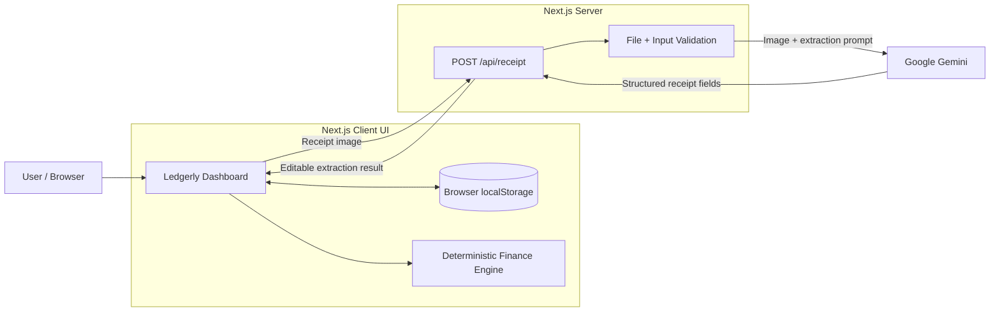

# Ledgerly — Personal Ledger Manager

> **LofiStack Hackathon 2026 · Problem P12 · Team LSH26-T022**

**Live:** https://lsh26-t022-p12.vercel.app  
**Repository:** https://github.com/johirul-islam-1/lsh26-t022-p12

Ledgerly is a lightweight personal finance workspace for salaried users who want to understand where their monthly income is going, capture expenses quickly from receipts, forecast the rest of the month, and turn remaining cash into realistic savings goals.

The product deliberately combines **AI where perception is useful** (receipt extraction) with **deterministic finance logic where correctness matters** (totals, comparisons, forecasts, savings projections, and DPS calculations).

---

## 1. Problem

Personal expense tracking often fails for two reasons:

1. **Data entry is inconvenient.**  
   Users receive paper receipts or bills, but manually typing the amount, date, merchant, and category for every expense creates friction.

2. **A list of transactions does not answer financial questions.**  
   Even after recording expenses, users still need to know:
   - How much of the salary has already been spent?
   - Which categories are consuming the most money?
   - What changed compared with last month?
   - At the current pace, how much will be spent by month end?
   - Will there be money left or a shortfall?
   - Can planned savings contributions actually be afforded?
   - When will a savings goal be completed?
   - What could the same monthly contribution become in a DPS-style deposit?

A useful personal ledger therefore needs to go beyond bookkeeping and turn recorded transactions into **clear, actionable monthly decisions**.

---

## 2. Product Goal

Ledgerly is designed around one primary job:

> **Help a salaried user understand the current month, anticipate the month-end outcome, and make realistic savings decisions with minimal data-entry friction.**

The solution focuses on four connected workflows:

1. Capture expenses manually or from a receipt.
2. Understand the current and previous month.
3. Forecast the rest of the month with number-backed insights.
4. Convert expected surplus into measurable savings-pocket plans and DPS projections.

---

## 3. Required P12 Capabilities

### 3.1 Salary and Expense Capture

The user can:

- set or update a monthly salary;
- manually add an expense;
- upload a receipt/bill image;
- extract the receipt amount, date, shop/merchant and category;
- review the extracted values before saving;
- correct extracted values when AI/OCR is imperfect;
- persist the saved ledger in the browser.

Supported receipt formats:

- JPEG
- PNG
- WebP

Maximum receipt size:

- 8 MB

---

### 3.2 Monthly Dashboard

For the selected month, Ledgerly presents:

- total spent;
- salary;
- available balance;
- comparison with the previous month;
- category-wise spending breakdown;
- largest expenses;
- month navigation.

The dashboard is intentionally month-aware so expenses from different months are not silently mixed together.

---

### 3.3 Forecast and Written Insights

For the active current month, the forecasting engine estimates the expected total monthly spend using the observed spending pace.

The primary formula is:

```text
Projected monthly spend
= spending recorded so far / elapsed days × days in month
```

From that projection the system derives:

```text
Expected remaining spending
= projected monthly spend - spending recorded so far
```

and:

```text
Expected month-end balance
= salary - projected monthly spend
```

The interface also generates at least three deterministic written insights backed by actual category names and BDT amounts.

This logic intentionally does **not** use a language model. Financial arithmetic should be reproducible and testable.

---

### 3.4 Savings Pockets and DPS Projection

Users can create savings pockets containing:

- pocket name;
- item/goal description;
- target amount;
- desired monthly contribution.

Ledgerly compares planned monthly savings with the forecast month-end savings budget.

If the total planned contribution is affordable, each pocket keeps its requested contribution.

If the plan is larger than the forecast savings budget, the system scales contributions proportionally so the user can see an **affordable effective monthly contribution** instead of an unrealistic plan.

For each pocket Ledgerly calculates:

- target amount;
- planned monthly contribution;
- affordable monthly contribution;
- estimated months to goal;
- expected completion date;
- DPS maturity value over the same time;
- total deposits;
- interest earned.

---

## 4. Why This Solution

A basic ledger could have stopped at CRUD transactions. Ledgerly instead connects the full decision chain:

```text
Receipt / manual expense
        ↓
Verified expense
        ↓
Monthly totals
        ↓
Category + previous-month context
        ↓
Month-end forecast
        ↓
Expected surplus / shortfall
        ↓
Affordable savings plan
        ↓
Completion date + DPS comparison
```

This makes every feature contribute to the next one.

The architecture also separates probabilistic and deterministic responsibilities:

```text
AI
└── receipt understanding only

Deterministic TypeScript
├── money arithmetic
├── monthly aggregation
├── comparisons
├── forecasting
├── insight selection
├── savings affordability
├── completion dates
└── DPS compounding
```

That separation reduces the chance of hallucinated financial outputs and keeps the results explainable.

---

## 5. User Experience

### First-Time User Journey

1. Open Ledgerly.
2. Review or edit the monthly salary.
3. Add an expense manually or scan a receipt.
4. Review extracted receipt values.
5. Correct anything that is wrong.
6. Save the expense.
7. Review the monthly dashboard.
8. Read forecast and spending insights.
9. Create or review savings pockets.
10. Adjust the DPS rate if needed.
11. Refresh the page and continue from the persisted ledger.

### Returning User Journey

A returning user can immediately:

- continue from locally persisted ledger data;
- navigate months;
- add a new expense;
- scan another receipt;
- inspect updated forecast numbers;
- review savings feasibility.

### Failure and Recovery UX

The product includes handling for:

- receipt upload validation;
- unsupported file types;
- oversized files;
- provider/API failures;
- retryable receipt extraction;
- editable extraction results;
- empty months;
- empty spending categories;
- invalid form values;
- loading states;
- user-visible errors.

A failed receipt scan does not invalidate the rest of the ledger. Manual expense entry remains available.

---

## 6. System Design

### Architecture Overview



---

## 7. Architectural Responsibilities

### Browser / UI Layer

Responsible for:

- user interaction;
- month selection;
- expense and salary forms;
- receipt review/edit flow;
- dashboard rendering;
- forecast presentation;
- savings-pocket management;
- DPS-rate editing;
- local persistence.

### Finance Domain Layer

Responsible for deterministic calculations including:

- BDT totals;
- category aggregation;
- largest-expense ranking;
- previous-month comparison;
- forecast calculations;
- written insight construction;
- savings affordability;
- goal duration;
- completion date;
- DPS return.

### Receipt API Layer

Responsible for:

- accepting multipart image upload;
- validating file type and size;
- keeping the Gemini API key server-side;
- calling the configured Gemini model;
- parsing structured extraction output;
- retry/fallback handling;
- returning editable receipt data to the client.

### External AI Provider

Gemini is used only to interpret the receipt image and suggest:

- amount;
- date;
- merchant/shop;
- category;
- confidence/quality information.

The extracted values are treated as **draft data**, not unquestionable truth. The user can correct them before saving.

---

## 8. Data Flow

### Receipt Capture Flow

```text
User selects receipt
        ↓
Client validates basic selection
        ↓
POST /api/receipt
        ↓
Server validates MIME type + size
        ↓
Gemini receipt extraction
        ↓
Structured result
        ↓
Editable review modal
        ↓
User confirms / corrects
        ↓
Expense appended to ledger
        ↓
localStorage updated
        ↓
Dashboard + forecast recomputed
```

### Monthly Analytics Flow

```text
Persisted ledger
        ↓
Filter expenses by active month
        ↓
Integer-paisa aggregation
        ↓
Spent / available
        ↓
Category totals
        ↓
Largest expenses
        ↓
Previous-month comparison
```

### Savings Planning Flow

```text
Current-month forecast
        ↓
Projected month-end balance
        ↓
max(balance, 0)
        ↓
Forecast savings budget
        ↓
Compare with planned pocket contributions
        ↓
Affordable contribution per pocket
        ↓
Months to target
        ↓
Completion date
        ↓
DPS projection over same duration
```

---

## 9. Financial Calculation Design

### Money Representation

Core financial calculations convert BDT values to **integer paisa** wherever practical.

This avoids relying on raw decimal floating-point arithmetic for values such as:

```text
BDT 10.10 + BDT 20.20
```

Internally, those values are treated as integer minor units.

---

### Forecast

For the active current month:

```text
projectedSpend = spentSoFar / elapsedDays × totalDaysInMonth
```

```text
expectedRemainingSpend = max(projectedSpend - spentSoFar, 0)
```

```text
projectedBalance = salary - projectedSpend
```

Past months use actual recorded spending rather than pretending to forecast a completed period.

---

### Savings Affordability

Let:

```text
forecastSavingsBudget = max(projectedBalance, 0)
```

and:

```text
plannedMonthly = sum(all requested pocket contributions)
```

If:

```text
forecastSavingsBudget >= plannedMonthly
```

then every pocket keeps its requested monthly contribution.

Otherwise:

```text
fundingRatio = forecastSavingsBudget / plannedMonthly
```

and each pocket receives:

```text
effectiveContribution
= requestedContribution × fundingRatio
```

This prevents the application from presenting savings commitments that exceed the expected month-end budget.

---

### Goal Completion

For a target amount and positive effective monthly contribution:

```text
monthsToGoal
= ceil(targetAmount / effectiveMonthlyContribution)
```

The completion date is derived from the number of monthly contribution cycles.

---

### DPS Rule

Ledgerly follows the supplied DPS calculation rule:

For every month:

```text
1. balance = balance + monthlyDeposit

2. interest
   = balance × annualRate / 12 / 100

3. round monthly interest half-up to paisa

4. balance = balance + roundedInterest
```

Interest becomes part of the balance, therefore future months earn interest on previous interest.

The implementation uses integer paisa and a deterministic half-up rounding routine for the monthly interest calculation.

---

## 10. Public-Case Validation

The finance engine was locally regression-tested against the supplied P12 public dataset.

Result:

```text
25 / 25 public cases passed
```

The run covered different:

- salaries;
- months and month lengths;
- elapsed-day positions;
- expense distributions;
- categories;
- savings targets;
- monthly contributions;
- DPS annual rates.

The public-case validator was used as a local verification harness and is not required by the production runtime.

Passing public cases does not imply that hidden evaluation cases are known; it provides evidence that the deterministic implementation is consistent across the supplied scenarios.

---

## 11. Technology Stack

| Layer | Technology | Responsibility |
|---|---|---|
| Framework | Next.js 16 | Application shell, client/server routing |
| UI runtime | React 19 | Interactive dashboard and forms |
| Language | TypeScript | Typed application and finance logic |
| AI integration | `@google/genai` | Receipt-image extraction |
| Validation | Zod | Structured validation/parsing |
| Icons | Lucide React | UI iconography |
| Persistence | Browser `localStorage` | Hackathon ledger persistence |
| Hosting | Vercel | Public production deployment |

The project intentionally avoids adding a database, authentication platform, queue, or additional infrastructure that was not necessary to satisfy the hackathon workflow.

---

## 12. Project Structure

The important repository structure is:

```text
lsh26-t022-p12/
├── src/
│   ├── app/
│   │   ├── api/
│   │   │   └── receipt/
│   │   │       └── route.ts
│   │   ├── globals.css
│   │   ├── layout.tsx
│   │   └── page.tsx
│   │
│   └── lib/
│       ├── finance.ts
│       └── types.ts
│
├── public/
│
├── ARCHITECTURE.md
├── EVENT.md
├── LICENSES.md
├── README.md
├── evaluation-manifest.json
│
├── package.json
├── package-lock.json
├── tsconfig.json
├── eslint.config.mjs
├── next.config.ts
├── next-env.d.ts
└── .gitignore
```

### Important Files

#### `src/app/page.tsx`

Main Ledgerly application UI and client-side product flow.

It coordinates:

- salary editing;
- expense creation;
- receipt scanning;
- extraction review;
- month selection;
- analytics display;
- forecast display;
- savings-pocket actions;
- DPS-rate changes;
- local persistence.

#### `src/app/api/receipt/route.ts`

Server-side receipt extraction endpoint.

Responsibilities:

- upload validation;
- API-key isolation;
- Gemini request;
- structured extraction;
- provider retry/fallback behavior;
- error responses.

#### `src/lib/finance.ts`

The deterministic finance engine.

Contains logic for:

- dashboard calculations;
- BDT/paisa conversion;
- monthly totals;
- category aggregation;
- ranking;
- forecasting;
- insights;
- savings planning;
- DPS projection.

This is intentionally separate from the UI so financial behavior can be reasoned about and tested independently.

#### `src/lib/types.ts`

Shared domain types used by the ledger, expenses, pockets and finance functions.

#### `evaluation-manifest.json`

Judge-facing project metadata and proof paths for the required P12 capabilities.

#### `LICENSES.md`

Third-party dependency and licensing record.

#### `ARCHITECTURE.md`

Additional architecture notes and implementation rationale.

#### `EVENT.md`

Hackathon event initialization/evidence file.

---

## 13. Local Development

### Prerequisites

- Node.js
- npm
- a Gemini API key for receipt scanning

Clone the repository:

```bash
git clone https://github.com/johirul-islam-1/lsh26-t022-p12.git
cd lsh26-t022-p12
```

Install dependencies:

```bash
npm install
```

Create:

```text
.env.local
```

with:

```env
GEMINI_API_KEY=your_private_key_here
GEMINI_MODEL=gemini-3.7-flash
```

Never commit `.env.local`.

Start the development server:

```bash
npm run dev
```

Then open:

```text
http://localhost:3000
```

---

## 14. Quality Gates

Run the following before release:

```bash
npm run typecheck
npm run lint
npm run build
git diff --check
```

The application was validated through:

- TypeScript type checking;
- ESLint;
- production Next.js build;
- production URL testing;
- receipt scan flow;
- manual expense flow;
- month navigation;
- local persistence;
- forecast verification;
- savings-pocket verification;
- DPS-rate verification;
- 25 supplied public finance cases.

---

## 15. API

### `GET /api/receipt`

Lightweight receipt-service health/configuration response used for production verification.

Example shape:

```json
{
  "ok": true,
  "build": "b1-receipt",
  "geminiConfigured": true,
  "model": "gemini-3.7-flash"
}
```

### `POST /api/receipt`

Accepts a receipt image as multipart form data.

Accepted MIME types:

```text
image/jpeg
image/png
image/webp
```

Maximum file size:

```text
8 MB
```

Returns a structured extraction for user review rather than silently saving AI output.

---

## 16. Persistence Strategy

Ledgerly uses browser `localStorage` for the hackathon build.

Why:

- no account requirement in the problem;
- instant local persistence;
- very low deployment risk;
- no database migration/setup;
- sufficient for a judge-visible single-user personal ledger.

What is persisted:

- ledger state;
- salary;
- expenses;
- savings pockets;
- DPS rate and related product state.

The application does not use a shared multi-user backend database.

### Trade-Off

This design optimizes hackathon reliability and setup simplicity, but data:

- is browser/device-specific;
- is not synchronized across devices;
- can be removed if browser storage is cleared;
- does not provide user accounts or cloud backup.

A commercial version would replace or augment local persistence with authenticated server-side storage.

---

## 17. Security and Privacy Notes

- Gemini credentials remain server-side.
- `.env.local` is excluded from Git.
- Receipt extraction is routed through the server so the browser does not receive the secret API key.
- Uploaded images are used for the extraction request; the Ledgerly data model persists the resulting ledger fields rather than maintaining a receipt-image archive.
- No authentication is implemented in the hackathon version because the application uses device-local persistence rather than a shared user database.
- The production API should receive rate limiting and stronger abuse controls before broad public commercial use.

---

## 18. Reliability Decisions

### Editable AI Output

Receipt extraction is probabilistic. Therefore AI output is never treated as final financial truth.

The user gets an editable confirmation step before saving.

### Deterministic Finance

Forecasts, dashboard totals and DPS returns do not depend on Gemini.

If the AI provider fails:

```text
receipt scanning may degrade
```

but:

```text
manual entry
dashboard
forecast
savings planning
DPS calculations
```

remain conceptually independent.

### Loading and Error States

Provider latency and failures are surfaced to the user instead of creating silent waits.

---

## 19. What Is Real vs. Seeded / Mocked

### Real

- manual expense capture;
- receipt-image upload;
- Gemini extraction;
- editable extraction review;
- salary updates;
- monthly calculations;
- previous-month comparison;
- category aggregation;
- largest expenses;
- forecast arithmetic;
- amount-backed insights;
- savings-pocket calculations;
- DPS projection;
- browser persistence;
- production deployment.

### Seeded

The application includes an initial sample ledger so the dashboard is immediately understandable and judge-visible before the user adds their own data.

The seeded data is ordinary application state and can be changed through the interface.

### Not Implemented / Not Pretended

- bank-account integration;
- real DPS bank account opening;
- actual transfer of savings money;
- cloud account synchronization;
- multi-user authentication;
- financial institution guarantees.

The DPS result is an **illustrative calculation based on the stated annual rate and supplied compounding rule**, not a bank quotation.

---

## 20. Key Product Decisions

### AI for Extraction, Not Arithmetic

Receipt interpretation benefits from multimodal AI. Finance calculations require deterministic correctness.

Using one technology for both would have increased risk without improving the user experience.

### Review Before Save

OCR/AI can misread a date or amount. An editable review step protects ledger accuracy.

### Month-Aware Ledger

Expenses are displayed and calculated according to their transaction month.

Adding a historical expense should not silently blend it into the selected/current month.

### Forecast as an Explainable Baseline

The pace-based forecast:

```text
spent / elapsed days × days in month
```

is intentionally simple, transparent and reproducible.

For a hackathon personal ledger, explainability is more valuable than an opaque predictive model with limited personal history.

### Forecast-Aware Savings

Savings plans should respond to projected reality.

If forecast month-end money is lower than requested savings contributions, Ledgerly makes that constraint visible instead of presenting an impossible plan.

---

## 21. Limitations

The hackathon build intentionally has a small operational footprint.

Current limitations include:

- browser-local persistence only;
- no authentication;
- no cross-device sync;
- no cloud backup;
- receipt extraction quality depends on image quality and external AI availability;
- no automatic bank/payment transaction import;
- no recurring-expense engine;
- no income sources beyond the monthly salary workflow;
- forecast is based on current-month pace rather than a long-term statistical model;
- savings pockets model planned contributions but do not move real money;
- DPS output is illustrative, not financial advice or a bank guarantee;
- no production-grade usage quotas/rate limiting for large-scale public traffic.

---

## 22. Future Roadmap

A production evolution could add:

### Persistence and Accounts

- authenticated user accounts;
- managed database;
- multi-device synchronization;
- encrypted receipt storage;
- exports and backup.

### Finance Automation

- recurring bills;
- multiple income streams;
- CSV/bank statement import;
- transaction deduplication;
- scheduled expense reminders;
- budget caps by category.

### Better Forecasting

After enough historical data exists:

- recurring-vs-variable spending separation;
- salary-cycle aware forecasting;
- weekday/weekend behavior;
- seasonality;
- confidence ranges;
- abnormal-spend detection.

Any future predictive model should still preserve a deterministic, explainable baseline.

### Savings

- current saved balance per pocket;
- contribution history;
- automatic priority allocation;
- scenario comparison;
- multiple deposit products/rates;
- institution-specific product terms.

### Production Operations

- API rate limiting;
- structured monitoring;
- audit logging;
- provider usage limits;
- privacy/retention policy;
- disaster recovery;
- accessibility audit;
- localization.

---

## 23. Demo Path

A concise judge demo can follow this sequence:

```text
1. Open monthly dashboard
2. Show salary + current spending
3. Scan a receipt
4. Review extracted amount/date/shop/category
5. Correct a value and save
6. Show dashboard recalculation
7. Navigate previous/current month
8. Show category breakdown + largest expenses
9. Show projected spend + month-end balance
10. Show three written amount-backed insights
11. Create/open savings pocket
12. Show affordable contribution + completion date
13. Change DPS rate
14. Show DPS maturity/deposit/interest
15. Refresh and confirm persistence
```

This flow demonstrates the product through user-visible evidence rather than implementation claims.

---

## 24. Submission Metadata

```text
Team ID: LSH26-T022
Problem ID: P12
Project: Ledgerly
Repository: https://github.com/johirul-islam-1/lsh26-t022-p12
Live URL: https://lsh26-t022-p12.vercel.app
```

Final submission should use the exact commit SHA required by the event submission form.

---

## 25. Team Contributions

- **FH-TOUHID** — P12 implementation, integration, testing and deployment.
- **Johirul Islam** — repository ownership / team coordination.

If additional registered members contributed to this repository, add their exact contribution before any permitted documentation freeze.

---

## 26. License Information

Third-party framework, library and package licensing is documented in:

```text
LICENSES.md
```

The project does not rely on a third-party UI template or bundled third-party image asset for the core interface.

---

## 27. Closing

Ledgerly is built around a simple idea:

> **Recording spending is only useful when the ledger helps the user decide what to do next.**

Receipt extraction reduces input friction.  
Monthly analytics create awareness.  
Forecasting creates foresight.  
Savings pockets turn that foresight into a concrete plan.

The result is a small, explainable personal finance system that connects transaction capture to month-end decisions without making deterministic financial logic dependent on generative AI.
